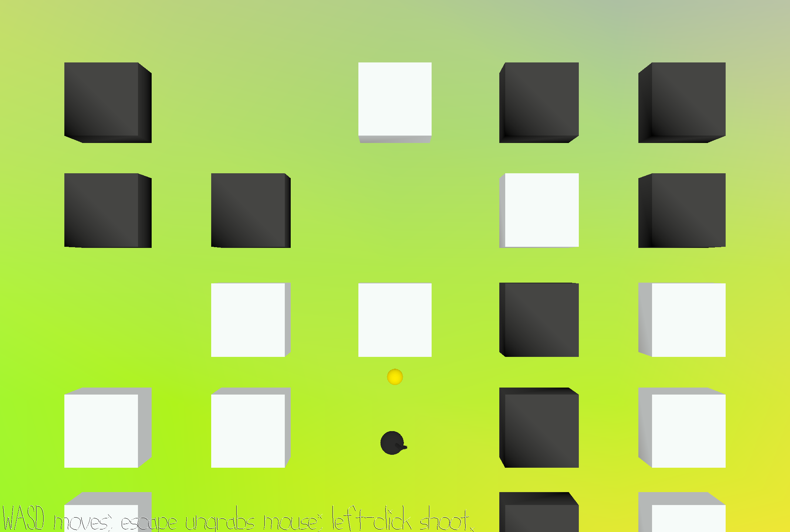

# StepByStep

**Author:** Jing Chung  

**Design:** Levels and gameplay change according to the music sections. Players must quickly adapt within a short amount of time.  

**Screenshot:**  

  

**How to Play:**  
- Use **A** and **D** on the keyboard to move left and right.  
- Use **Left Mouse Click** to shoot bullets.  
- Press **Spacebar** to jump.  

This game was built with [NEST](NEST.md).  